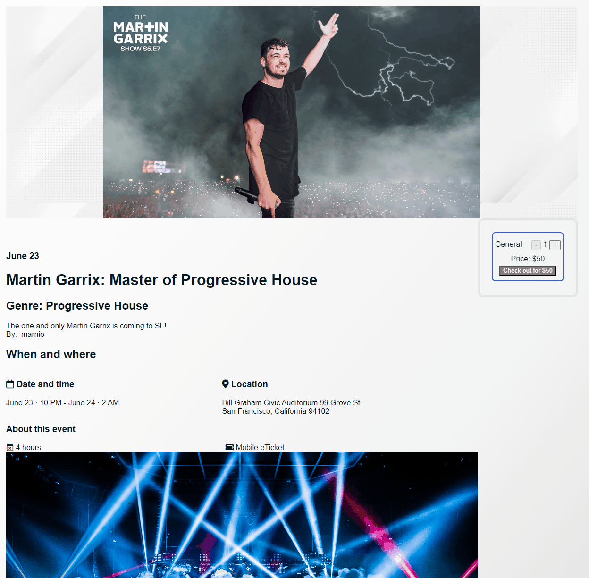
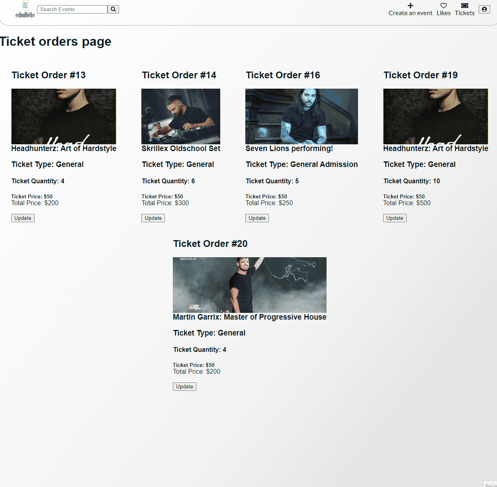
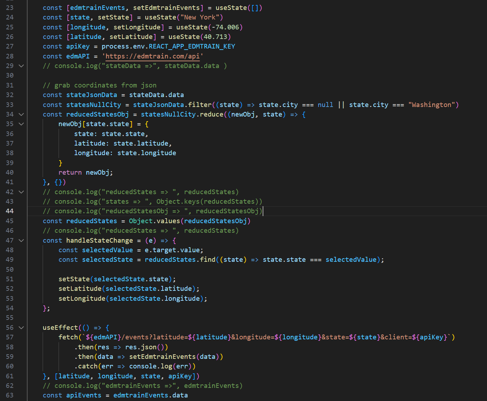

# edmBrite

Welcome to edmBrite, an app that enables users to create, search and attend events relating to EDM (Electronic Dance Music).

Live link -> https://edmbrite.onrender.com/

## Technologies Used
### Frontend
- **React**
- **Redux**
- **JavaScript**
- **HTML/CSS**
### Backend
- **Flask**
- **Python**
- **SQLAlchemy**
- **PostgreSQL**

## Features
This web application was designed and developed within a two-week time period.
Below are all the main features I was able to implement.

### Events
#### Events Page
- Displays the events that users have created
- Also displays actual events from [edmtrain](https://edmtrain.com/)

#### Create an Event
- Users are able to create an event
- Once created, user will be redirected to events page

#### Event details page
- Users can get to details by clicking on an event
- Displays information such as location, date, and time of the event
- Users are able to buy tickets if they are logged in

### Tickets/Registration
#### Buying Tickets
- Users can buy tickets to an event
- Users are redirected to their personal orders/tickets page

#### Orders/Tickets page
- Users are able to see their orders on which events they bought tickets to
- Users are also able to update their order

### Like events
- Users can like/favorite created events
- Users can see what events they liked on their personal likes page

## Additional features
### Search
- Users can query for events based on event name, summary, venue, description or owner's username
- Users can also reorder events from events coming soon to events coming later

### [edmtrain](https://edmtrain.com/) API integration
  - Primarily used their [API](https://edmtrain.com/api-documentation) to get actual events onto site
  - Users are able to change the state based on selected state
  - Users can click on an event and will be redirected to edmtrain's website

## Future features
- ### Google maps integration
  - Have users be able to see on a map where events are
- ### AWS S3 usage
  - Have users not have to copy/paste an image url, and be able to select a file from their computer

## Code snippets
### [edmtrain](https://edmtrain.com/) Live events display and state selector

I implemented using an external API to render live events that are happening in the state a user selects. I faced many challenges for this feature. The **first** challenge was trying to hide the API key on GitHub.

First, I created a route in the backend that calls their API. It was working, but it took a very long time for the events to render on change. I tried again in the frontend, and not only did I hide the key, but was able to render the events with a fast load time!

I fixed this by creating a `.env` file in root of my react app, and named the variable `REACT_APP_EDMTRAIN_KEY`.

The **second** challenge was figuring out how to render the events based on what state was selected. For events to render with edmtrain's API, I needed to at least include longitude and latitude. By using a json file with that information in the same directory, first keyed into the data. Then with that data, I filtered if there isn't a city because I just wanted the state data. Then I also filtered if there is a city called Washington since Washington D.C isn't a state. I then created a new object to hold this data, and then depending on if the state changes, I would set the new state, longitude and latitude.

I have previously never worked with using an external API. Understanding the documentation that edmtrain had, keeping the client key hidden, and understanding how to render those events were key to making this work. In the end, I was able render in live events! So if any of the users are interested in attending an event in their state, they can!

